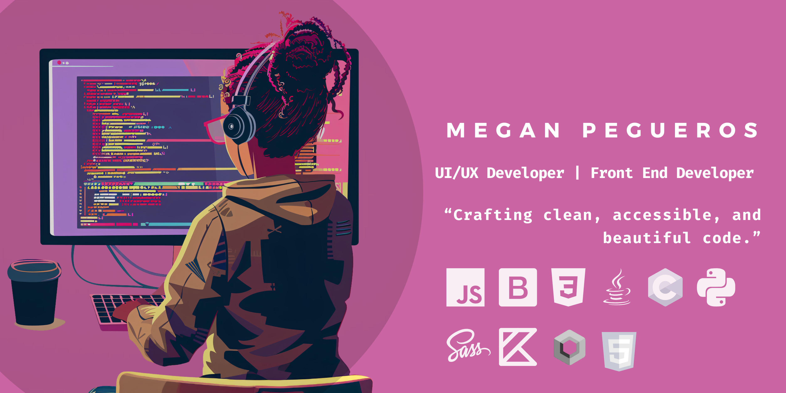

  </a>

<h1>Hi everyone, I'm Mariana Pegueros </h1>

  

    
  

  ### 👩‍💻 About Me
  <ul>
    <li>✨ <b>Front-end & UI/UX Designer</b> with a sharp eye for detail and high-quality code.</li>
    <li>🎨 Crafting <b>User-Centric Experiences</b> where design meets functionality.</li>
    <li>📱 Exploring <b>Mobile Development</b> & Design Systems (Web lover too!).</li>
    <li>🚀 Building scalable products and <b>creative tech</b>.</li>
    <li>💬 <b>Let's connect!</b> I'm always open to discussing design or collaborations.</li>
  </ul>

  

    <i><b>“I believe that good design is not just how it looks, but how it works and solves problems.”<b><i>
  

    
## 🛠️ Tech Stack

  <h4><i>UI/UX & Web Development</i></h4>
  <table>
  <tr border: none;>
   <td align="center" width="110">
      
       Figma
    </td>
    <td align="center" width="110">
      
       Sass/SCSS
    </td>
    <td align="center" width="110">
      
       Bootstrap
    </td>
    <td align="center" width="110">
      
       Javascript
    </td>
    <td align="center" width="110">
      
       HTML 5
    </td>
    <td align="center" width="110">
      
       CSS
    </td>
  </tr>
</table>

  <h4><i>Mobile Engineering:</i></h4>
  <table>
  <tr border: none;>
    <td align="center" width="110">
      
       Flutter
    </td>
    <td align="center" width="110">
      
       Dart
    </td>
    <td align="center" width="110">
      
       Kotlin
    </td>
    <td align="center" width="110">
      
       MaterialIU
    </td>
  </tr>
</table>

  <h4><i>Operating Systems:</i></h4>
  <table>
    <tr border: none;>
      <td align="center" width="110">
        
         Debian
      </td>
      <td align="center" width="110">
        
         Ubuntu
      </td>
      <td align="center" width="110">
        
         Windows
      </td>
    </tr>
  </table>

  <h4><i>Other tools:</i></h4>
  <table>
    <tr border: none;>
      <td align="center" width="110">
        
         Java
      </td>
      <td align="center" width="110">
        
         Python
      </td>
      <td align="center" width="110">
        
         PHP
      </td>
      <td align="center" width="110">
        
         MySQL
      </td>
      <td align="center" width="110">
        
         Bash
      </td>	  
      </tr>
          <tr>
      <td align="center" width="110">
        
         Git
      </td>
      <td align="center" width="110">
        
         VS Code
      </td>
      <td align="center" width="110">
        
         Android Studio
      </td>
    </tr>
  </table>

<h2> GitHub Stats</h2>
&nbsp;

  <a href="https://github.com/mpegueros">
    
     
    
    
    
    
  </a>

## 💻 &nbsp;Popular Projects

  
  
   

  <h2><i>🤝🏻  &nbsp;Connect with Me</i></h2>
  <table align="center">
    <tr border: none;>
     <td align="center" width="110">
        
         LinkedIn
      </td>
      <td align="center" width="110">
        
         Gmail
      </td>
    </tr>
  </table>

-----
Credits: [Mariana Pegueros](https://github.com/mpegueros)

  <small>Last Edited on: 01/07/2026</small>

